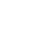
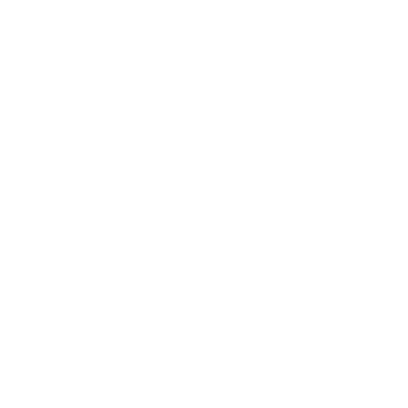
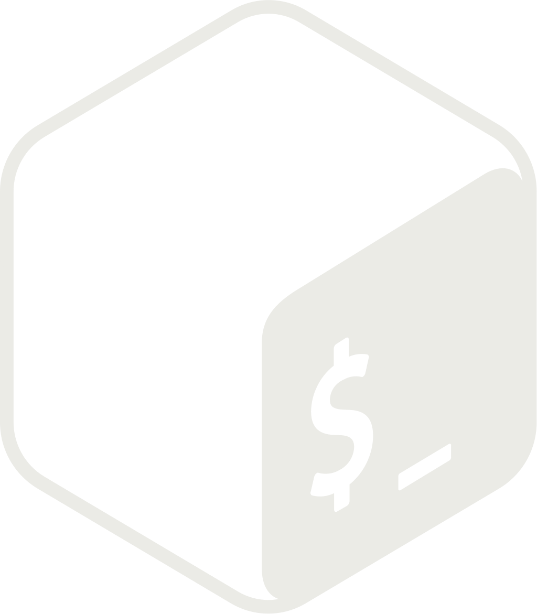

## About Me

Low-level systems, networks & sitcoms.

## Languages, Tools & Software

  
  
  &nbsp;&nbsp;
  
  
  &nbsp;&nbsp;
  
  
  &nbsp;&nbsp;
  
  
  &nbsp;&nbsp;
  
  
  &nbsp;&nbsp;
  
  

## Get in touch

  
  
  &nbsp;&nbsp;&nbsp;&nbsp;
  
  
  &nbsp;&nbsp;&nbsp;&nbsp;
  
  

